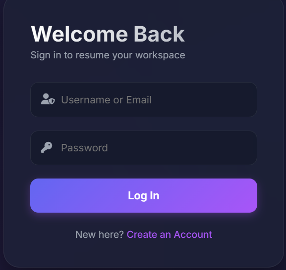
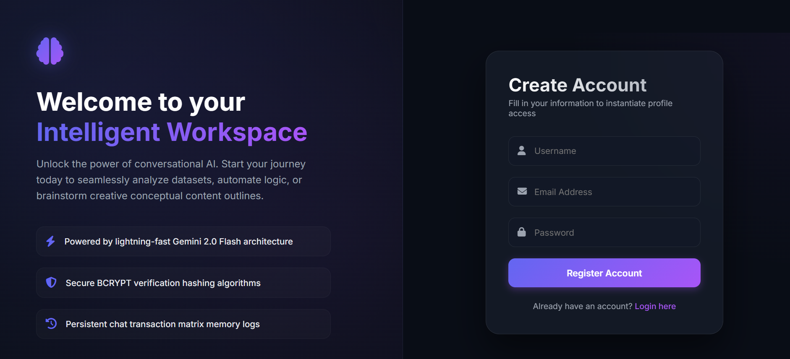
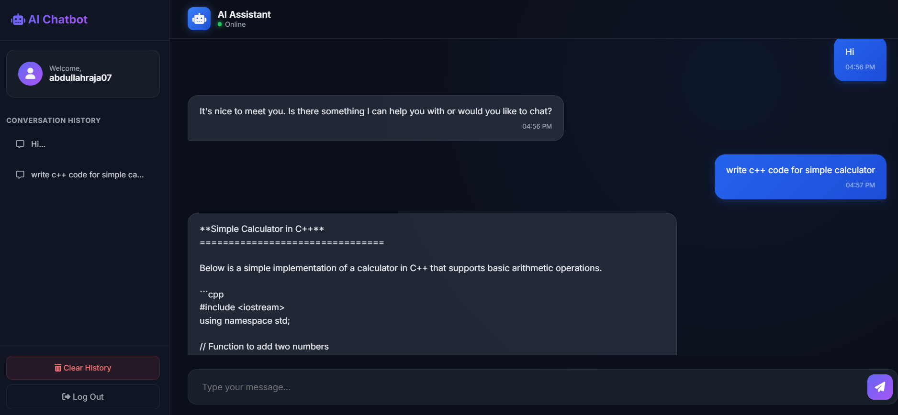

# AI Chatbot Web Application

A full-stack AI-powered chatbot built using PHP, MySQL, JavaScript, and Groq API.

## Features

- User Authentication
- AI Chat Interface
- Chat History
- Secure Session Management
- Responsive Design

## Tech Stack

- PHP
- MySQL
- JavaScript
- HTML5
- CSS3
- Groq API
- LLaMA 3.3 70B

## Installation

1. Clone repository
2. Import database
3. Configure API key
4. Run using XAMPP

## Screenshots

### Login Page

### Registration Page

### Chat Interface

### Chat History

